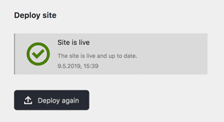

# Kirby Webhook Field

This plugin provides a panel field for [Kirby CMS](https://getkirby.com/). Use it to easily trigger [webhooks](https://en.wikipedia.org/wiki/Webhook) from the Kirby panel. 
Probably the most common use case for a webhook would be to trigger a build or deploy mechanism.

## Why use this

If you have a static site that is run by Kirby, you will want to have a mechanism where editors can trigger a new build/deploy and see the current status of the site.
This is probably the most common use case for triggering a webhook from inside your CMS.
You could also use it to communicate with Zapier, IFTTT, an email app or other services though. Basically any time you want to trigger an outside service that is implemented with a webhook and you want to see the result in the panel, you can use this plugin.

You can even use it just to access any API and to with the data whatever you want, but then you need to manually take care of the state of the panel field.

## Installation

### Manual
Just download this repo and put the content into `/site/plugins/webhook-field`.

### As git submodule
Run `git submodule add https://github.com/pju-/kirby-webhook-field site/plugins/webhook-field` in the root of your Kirby installation.

### With composer
Run `composer require pju/kirby-webhook-field` in the root of your Kirby installation.

## Next Steps

[Quickstart guide](https://github.com/pju-/kirby-webhook-field/tree/master/docs/quickstart.md). 

If you want to quickly set up a deploy hook, check the quickstart guide.
 
 

[Full options guide](https://github.com/pju-/kirby-webhook-field/tree/master/docs/config.md). 

Check out all the options if you have a more advanced setup or want to learn more about the possibilities the plugin offers.

## Caveats

### Is this ready for production?
I run it on several live sites. For you typical use case you should be able to use it without hesitation. There are some corner cases that I am aware of where behaviour is not ideal.
At the moment these concern sites with a large amount of pages or with multiple languages. For these the implementation of the "last modified" date is not ideal. You should [disable the "outdated" option for those sites](https://github.com/pju-/kirby-webhook-field/tree/master/docs/config.md#hook-structure). You can comment on [this ticket](https://github.com/pju-/kirby-webhook-field/issues/8) if you want to see progress there more quickly.

### Can I use this to communicate with an API?
You can certainly use it to send data to an API. You will have access to the result of your API call via the `callback` option. However, if your API call does not result in a subsequent incoming call to the `status` endpoint, you will have to take care of setting the new status yourself.
If you need this right now, let me know [in this ticket](https://github.com/pju-/kirby-webhook-field/issues/10) or create your own.

### Is this safe?
Incoming request to the `status` endpoint provided by the plugin will only change the state of the field. Invalid states are discarded. However, I would still recommend [setting the name of the endpoint to something safe](https://github.com/pju-/kirby-webhook-field/blob/master/docs/config.md#endpoint). You can treat the name almost like an API token.
